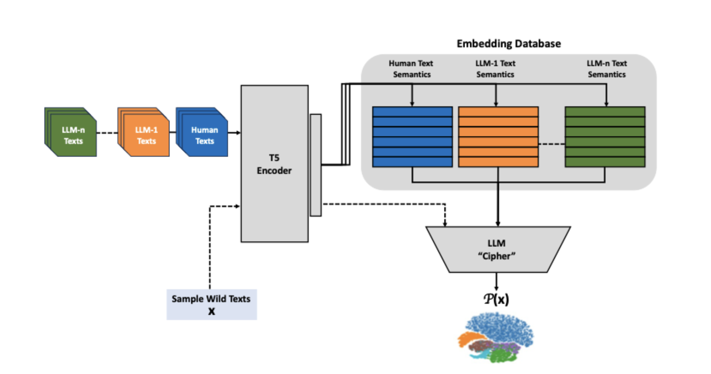
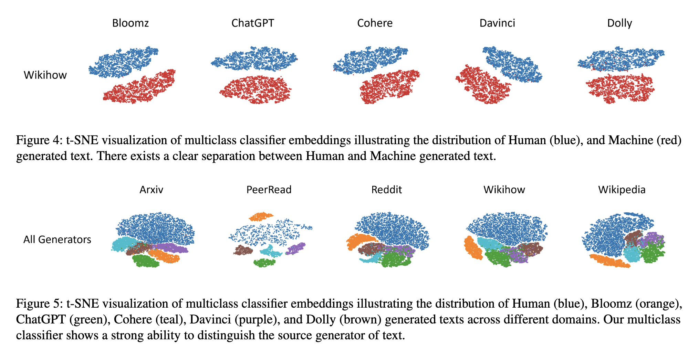

# Deciphering Textual Authenticity: A Generalized Strategy through the Lens of Large Language Semantics for Detecting Human vs. Machine-Generated Text

## For Usenix 2024 Submission

With the recent proliferation of Large Language Models
(LLMs), there has been an increasing demand for tools to
detect machine-generated text. The effective detection of
machine-generated text face two pertinent problems: First,
they are severely limited against real-world scenarios, where
machine-generated text is produced by diverse generators
(e.g., ranging from ChatGPT to Dolly) and diverse domains
(e.g., ranging from technical papers on Arxiv to social me-
dia). Second, existing detectors consider machine-generated
text solely as a binary classification problem, disregarding
the sub-categories of artifacts generated by diverse genera-
tors. In this work, we undertake a systematic study on the
detection of machine-generated text in real-world scenarios.
We first study the effectiveness of state-of-the-art approaches
and find that they are severely limited against text produced
by diverse generators and domains. Furthermore, t-SNE vi-
sualizations of the embeddings from a pretrained LLM’s en-
coder show that they are capable of distinguishing human and
machine-generated text. Based on our findings, we introduce
a novel system for detecting machine-generated text using
a pretrained LLM encoder to represent diverse texts and ad-
dress the sub-distribution issue by framing it as a multi-class
classification problem. We evaluate our approach across 9
machine-generated text systems and 9 domains and find that
our approach provides state-of-the-art generalization ability,
with an average increase in F1 score on machine-generated
text of 19.6% on unseen generators and domains compared
to the top performing existing approaches and correctly at-
tributes the generator of text with an accuracy of 93.6%

